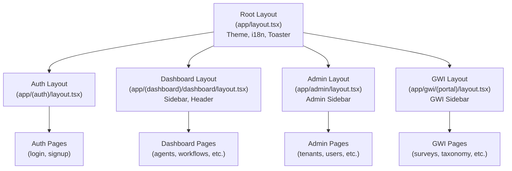
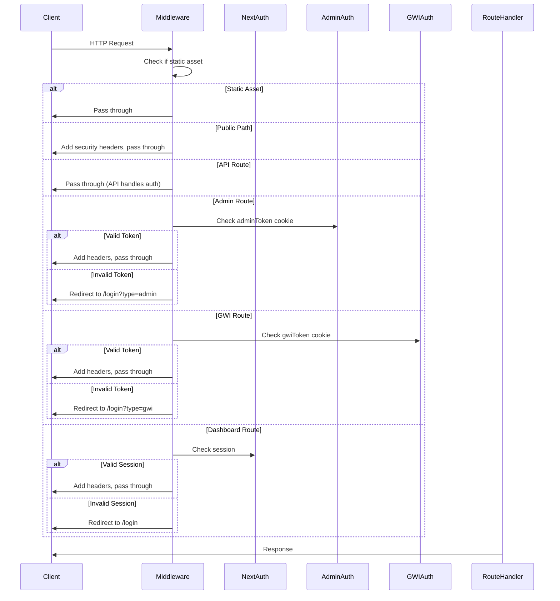
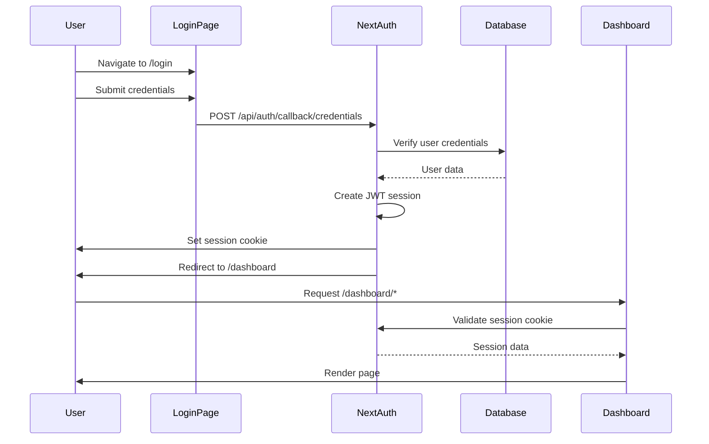
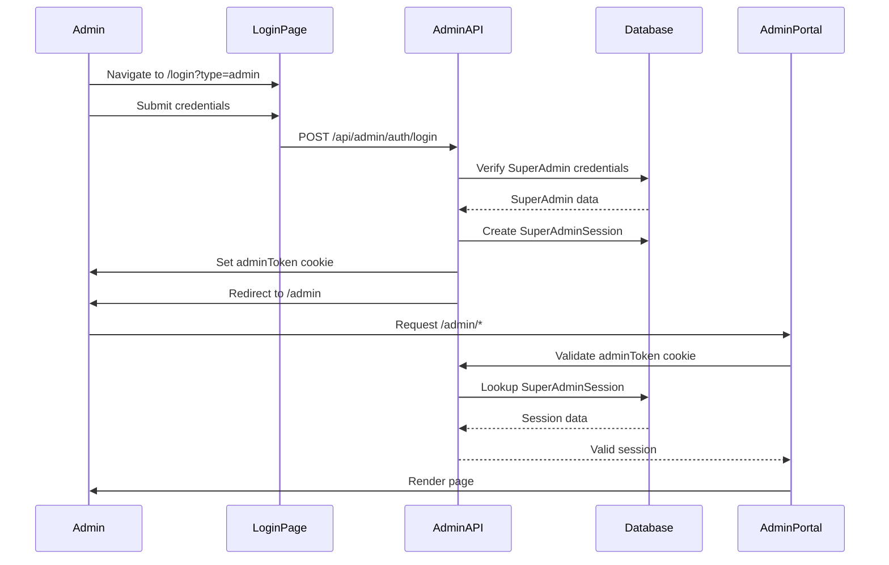
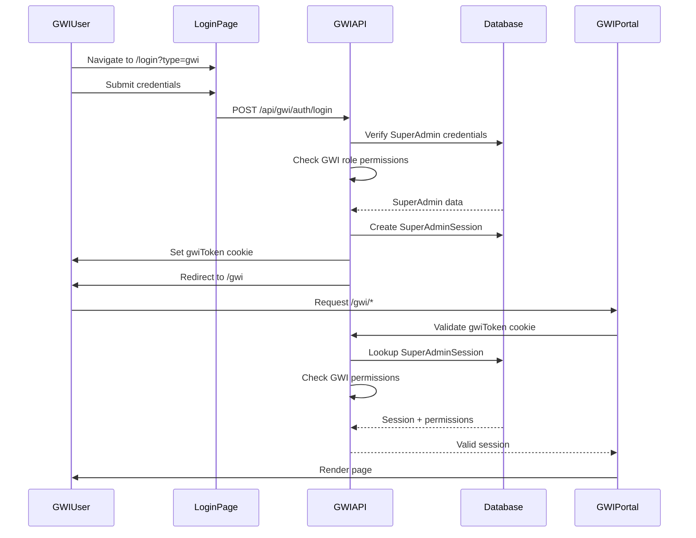
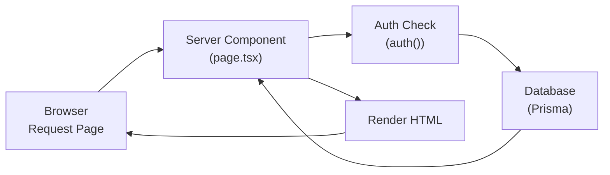
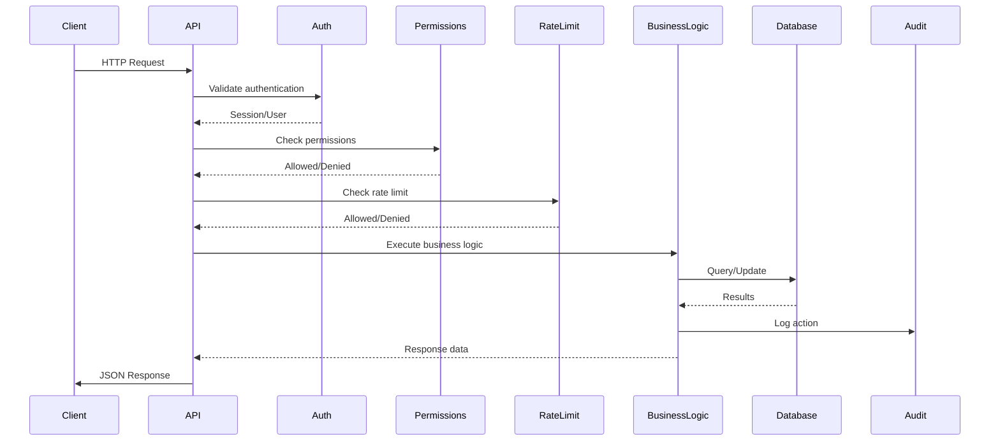
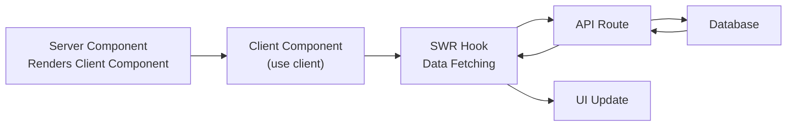

# Application Architecture

**Version:** 1.0  
**Last Updated:** January 2026  
**Status:** Production Ready

---

## Table of Contents

1. [Next.js App Router Structure](#nextjs-app-router-structure)
2. [Server vs Client Components](#server-vs-client-components)
3. [API Route Organization](#api-route-organization)
4. [Middleware and Request Flow](#middleware-and-request-flow)
5. [Authentication Flow Diagrams](#authentication-flow-diagrams)
6. [Data Flow Diagrams](#data-flow-diagrams)
7. [File Organization](#file-organization)

---

## Next.js App Router Structure

The application uses Next.js 16 App Router with a file-system-based routing system. The `app/` directory contains all routes and pages.

### Directory Structure

```
app/
├── layout.tsx                    # Root layout (providers, theme, i18n)
├── page.tsx                      # Landing page (/)
├── error.tsx                      # Global error boundary
├── global-error.tsx               # Global error handler
├── not-found.tsx                  # 404 page
│
├── (auth)/                       # Route group - public auth pages
│   ├── layout.tsx
│   ├── login/
│   ├── signup/
│   ├── forgot-password/
│   └── reset-password/
│
├── (dashboard)/                  # Route group - user dashboard
│   └── dashboard/
│       ├── layout.tsx            # Dashboard layout with sidebar
│       ├── page.tsx               # Dashboard home
│       ├── agents/
│       ├── workflows/
│       ├── reports/
│       ├── playground/
│       └── ...
│
├── (admin-auth)/                 # Route group - admin login redirect
│   └── admin/
│
├── admin/                        # Admin portal pages
│   ├── layout.tsx                # Admin layout
│   ├── page.tsx                  # Admin home
│   ├── tenants/
│   ├── users/
│   ├── analytics/
│   └── ...
│
├── gwi/                          # GWI portal pages
│   ├── (portal)/
│   │   ├── layout.tsx            # GWI layout
│   │   ├── surveys/
│   │   ├── taxonomy/
│   │   ├── pipelines/
│   │   └── ...
│   └── CONTEXT.md
│
├── api/                          # API routes
│   ├── v1/                       # Public API v1
│   ├── v2/                       # Public API v2
│   ├── admin/                    # Admin API
│   ├── gwi/                      # GWI API
│   ├── auth/                     # NextAuth routes
│   └── webhooks/                 # Webhook handlers
│
└── [public-pages]/               # Public marketing pages
    ├── about/
    ├── pricing/
    ├── docs/
    └── ...
```

### Route Groups

Route groups (directories wrapped in parentheses) organize routes without affecting the URL structure:

- `(auth)` - Groups authentication pages with shared layout
- `(dashboard)` - Groups dashboard routes
- `(admin-auth)` - Admin login redirect handler
- `gwi/(portal)` - GWI portal routes

### Layout Hierarchy



---

## Server vs Client Components

The application follows a **server-first** architecture, using Server Components by default and Client Components only when needed.

### Server Components (Default)

**When to use:**
- Data fetching from database
- Accessing backend resources (APIs, files)
- Keeping sensitive information on server
- Reducing client-side JavaScript bundle

**Pattern:**
```typescript
// app/dashboard/agents/page.tsx
import { prisma } from '@/lib/db'
import { auth } from '@/lib/auth'

export default async function AgentsPage() {
  const session = await auth()
  const agents = await prisma.agent.findMany({
    where: { orgId: session.user.orgId }
  })
  
  return <AgentsList agents={agents} />
}
```

**Key characteristics:**
- Async by default
- Direct database access
- No React hooks (`useState`, `useEffect`, etc.)
- No browser APIs
- Can import Server-only modules

### Client Components

**When to use:**
- Interactivity (onClick, onChange, etc.)
- React hooks (`useState`, `useEffect`, `useRouter`)
- Browser APIs (localStorage, window, etc.)
- Event listeners
- Third-party libraries requiring client-side JavaScript

**Pattern:**
```typescript
// components/agents/agent-form.tsx
"use client"

import { useState } from 'react'
import { useRouter } from 'next/navigation'

export function AgentForm() {
  const [name, setName] = useState('')
  const router = useRouter()
  
  const handleSubmit = async () => {
    // API call
    router.refresh()
  }
  
  return <form onSubmit={handleSubmit}>...</form>
}
```

**Key characteristics:**
- Must have `"use client"` directive at top
- Can use React hooks
- Can access browser APIs
- Runs in browser
- Cannot directly access database

### Hybrid Pattern

Server Components can render Client Components:

```typescript
// Server Component (page.tsx)
import { AgentForm } from '@/components/agents/agent-form'
import { prisma } from '@/lib/db'

export default async function CreateAgentPage() {
  const templates = await prisma.template.findMany()
  
  return (
    <div>
      <h1>Create Agent</h1>
      {/* Client Component for interactivity */}
      <AgentForm templates={templates} />
    </div>
  )
}
```

---

## API Route Organization

The API is organized into three main namespaces, each serving different purposes.

### Public API (`/api/v1/`)

**Purpose:** Customer-facing API for user dashboard features

**Authentication:** NextAuth session (JWT)

**Key Endpoints:**

```
/api/v1/
├── agents/              # Agent CRUD and execution
├── workflows/           # Workflow management
├── reports/             # Report generation
├── dashboards/          # Dashboard management
├── audiences/           # Audience analysis
├── crosstabs/           # Crosstab analysis
├── brand-tracking/      # Brand tracking
├── charts/              # Chart management
├── memory/              # Memory operations
├── projects/            # Project management
├── templates/           # Template management
├── organization/        # Organization settings
└── ...
```

**Pattern:**
```typescript
// app/api/v1/agents/route.ts
import { NextRequest, NextResponse } from 'next/server'
import { auth } from '@/lib/auth'
import { getValidatedOrgId } from '@/lib/tenant'
import { hasPermission } from '@/lib/permissions'

export async function GET(request: NextRequest) {
  const session = await auth()
  if (!session?.user?.id) {
    return NextResponse.json({ error: 'Unauthorized' }, { status: 401 })
  }
  
  const orgId = await getValidatedOrgId(request, session.user.id)
  // ... business logic
}
```

### Admin API (`/api/admin/`)

**Purpose:** Platform administration endpoints

**Authentication:** Cookie-based (`adminToken`)

**Key Endpoints:**

```
/api/admin/
├── tenants/            # Tenant management
├── users/              # User management
├── analytics/          # Platform analytics
├── audit/              # Audit logs
├── compliance/         # Compliance management
├── security/           # Security policies
├── health/             # Health monitoring
└── ...
```

**Pattern:**
```typescript
// app/api/admin/tenants/route.ts
import { cookies } from 'next/headers'
import { validateSuperAdminSession } from '@/lib/super-admin'

export async function GET(request: NextRequest) {
  const cookieStore = await cookies()
  const token = cookieStore.get('adminToken')?.value
  
  if (!token) {
    return NextResponse.json({ error: 'Unauthorized' }, { status: 401 })
  }
  
  const session = await validateSuperAdminSession(token)
  // ... admin logic
}
```

### GWI API (`/api/gwi/`)

**Purpose:** Internal GWI team tools

**Authentication:** Cookie-based (`gwiToken`)

**Key Endpoints:**

```
/api/gwi/
├── surveys/            # Survey management
├── taxonomy/           # Taxonomy management
├── pipelines/          # Data pipeline management
├── llm/                # LLM configuration
├── agents/              # Agent template management
├── data-sources/       # Data source connections
└── ...
```

**Pattern:**
```typescript
// app/api/gwi/surveys/route.ts
import { cookies } from 'next/headers'
import { validateSuperAdminSession } from '@/lib/super-admin'
import { hasGWIPermission } from '@/lib/gwi-permissions'

export async function GET(request: NextRequest) {
  const cookieStore = await cookies()
  const token = cookieStore.get('gwiToken')?.value
  
  if (!token) {
    return NextResponse.json({ error: 'Unauthorized' }, { status: 401 })
  }
  
  const session = await validateSuperAdminSession(token)
  
  if (!hasGWIPermission(session.admin.role, 'surveys:read')) {
    return NextResponse.json({ error: 'Forbidden' }, { status: 403 })
  }
  
  // ... GWI logic
}
```

---

## Middleware and Request Flow

The middleware (`middleware.ts`) handles authentication, authorization, and request routing before requests reach route handlers.

### Middleware Flow



### Middleware Responsibilities

1. **Static Asset Handling**
   - Skip middleware for `/_next/`, static files, images
   - Immediate pass-through for performance

2. **Public Path Routing**
   - Allow access to public pages (/, /about, /pricing, etc.)
   - Add security headers

3. **API Route Handling**
   - Pass through to API handlers
   - API routes handle their own authentication

4. **Portal-Specific Authentication**
   - Admin routes: Check `adminToken` cookie
   - GWI routes: Check `gwiToken` cookie
   - Dashboard routes: Check NextAuth session

5. **Security Headers**
   - Add security headers to all responses
   - CSP, HSTS, X-Frame-Options, etc.

### Security Headers

The middleware adds comprehensive security headers:

```typescript
- X-DNS-Prefetch-Control: on
- Strict-Transport-Security: max-age=63072000; includeSubDomains; preload
- X-Frame-Options: SAMEORIGIN
- X-Content-Type-Options: nosniff
- Referrer-Policy: strict-origin-when-cross-origin
- Permissions-Policy: camera=(), microphone=(), geolocation=()
- X-XSS-Protection: 1; mode=block
- Content-Security-Policy: [comprehensive CSP]
- Cross-Origin-Opener-Policy: same-origin
- Cross-Origin-Resource-Policy: same-origin
```

**Reference:** `middleware.ts` - `addSecurityHeaders()` function

---

## Authentication Flow Diagrams

### User Dashboard Authentication (NextAuth)



**Key Points:**
- JWT-based sessions stored in HTTP-only cookies
- Session validated on each request via `auth()` function
- Supports credentials, Google OAuth, Microsoft OAuth
- Session includes user ID, email, organization context

### Admin Portal Authentication



**Key Points:**
- Cookie-based authentication (`adminToken`)
- Session stored in `SuperAdminSession` table
- 24-hour session expiration
- IP address and user agent tracking

### GWI Portal Authentication



**Key Points:**
- Shared authentication infrastructure with admin portal
- Additional permission checks via `hasGWIPermission()`
- Role-based access (GWI_ADMIN, DATA_ENGINEER, etc.)
- Same session table but different cookie name

---

## Data Flow Diagrams

### Server Component Data Flow



**Example:**
```typescript
// app/dashboard/agents/page.tsx
export default async function AgentsPage() {
  // 1. Authenticate
  const session = await auth()
  
  // 2. Fetch data
  const agents = await prisma.agent.findMany({
    where: { orgId: session.user.orgId }
  })
  
  // 3. Render
  return <AgentsList agents={agents} />
}
```

### API Route Data Flow



**Example:**
```typescript
// app/api/v1/agents/route.ts
export async function GET(request: NextRequest) {
  // 1. Authenticate
  const session = await auth()
  
  // 2. Validate organization
  const orgId = await getValidatedOrgId(request, session.user.id)
  
  // 3. Check permissions
  const membership = await getUserMembership(session.user.id, orgId)
  if (!hasPermission(membership.role, 'agents:read')) {
    return NextResponse.json({ error: 'Forbidden' }, { status: 403 })
  }
  
  // 4. Check rate limit
  const rateLimitResult = await checkRateLimit(...)
  
  // 5. Fetch data
  const agents = await prisma.agent.findMany({ where: { orgId } })
  
  // 6. Audit log
  await logAuditEvent(...)
  
  // 7. Return response
  return NextResponse.json({ agents })
}
```

### Client Component Data Flow



**Example:**
```typescript
// components/agents/agents-list.tsx
"use client"

import useSWR from 'swr'

export function AgentsList() {
  const { data, error } = useSWR('/api/v1/agents', fetcher)
  
  if (error) return <Error />
  if (!data) return <Loading />
  
  return <List agents={data.agents} />
}
```

---

## File Organization

### Core Application Files

```
app/
├── layout.tsx              # Root layout (providers, theme)
├── page.tsx                # Landing page
├── error.tsx               # Error boundary
├── global-error.tsx        # Global error handler
├── not-found.tsx           # 404 page
└── globals.css             # Global styles
```

### Route Organization

**Route Groups:**
- `(auth)` - Public authentication pages
- `(dashboard)` - User dashboard routes
- `(admin-auth)` - Admin login redirect

**Portal Routes:**
- `dashboard/` - User dashboard (NextAuth protected)
- `admin/` - Admin portal (adminToken protected)
- `gwi/` - GWI portal (gwiToken protected)

**Public Routes:**
- `about/`, `pricing/`, `docs/`, etc. - Marketing pages

### API Organization

```
app/api/
├── v1/                     # Public API v1
│   ├── agents/
│   ├── workflows/
│   └── ...
├── v2/                     # Public API v2 (future)
├── admin/                  # Admin API
│   ├── tenants/
│   ├── users/
│   └── ...
├── gwi/                    # GWI API
│   ├── surveys/
│   ├── taxonomy/
│   └── ...
├── auth/                   # NextAuth routes
│   └── [...nextauth]/
└── webhooks/               # Webhook handlers
    └── stripe/
```

### Component Organization

```
components/
├── ui/                     # Base UI components (shadcn/ui)
├── admin/                  # Admin-specific components
├── gwi/                    # GWI-specific components
├── dashboard/              # Dashboard components
├── agents/                 # Agent components
├── workflows/              # Workflow components
├── reports/                # Report components
└── ...
```

### Library Organization

```
lib/
├── db.ts                   # Prisma client
├── auth.ts                 # NextAuth configuration
├── super-admin.ts          # Admin/GWI authentication
├── permissions.ts          # Permission checking
├── tenant.ts               # Multi-tenancy utilities
├── llm.ts                  # AI agent execution
├── workflow-steps.ts       # Workflow engine
├── tool-registry.ts        # Tool system
├── audit.ts                # Audit logging
├── rate-limit.ts           # Rate limiting
└── ...
```

---

## Next.js 16 Specific Patterns

### Async Params (Breaking Change)

In Next.js 16, `params` in dynamic routes is a Promise:

```typescript
// ✅ Correct (Server Component)
export default async function DetailPage({ 
  params 
}: { 
  params: Promise<{ id: string }> 
}) {
  const { id } = await params
  // Use id
}

// ✅ Correct (Client Component)
"use client"
import { use } from 'react'

export default function DetailPage({ 
  params 
}: { 
  params: Promise<{ id: string }> 
}) {
  const { id } = use(params)
  // Use id
}

// ❌ Wrong (Next.js 15 pattern)
export default function DetailPage({ 
  params 
}: { 
  params: { id: string } 
}) {
  const { id } = params // id is undefined!
}
```

### Server Actions

Server Actions allow form submissions and mutations directly from Server Components:

```typescript
// app/actions/agents.ts
'use server'

import { prisma } from '@/lib/db'
import { auth } from '@/lib/auth'

export async function createAgent(formData: FormData) {
  const session = await auth()
  const name = formData.get('name') as string
  
  const agent = await prisma.agent.create({
    data: {
      name,
      orgId: session.user.orgId,
      // ...
    }
  })
  
  return agent
}
```

---

## Related Documentation

- [System Overview](./SYSTEM_OVERVIEW.md) - High-level platform overview
- [Database Architecture](./DATABASE_ARCHITECTURE.md) - Database schema and relationships
- [Authentication Architecture](./AUTH_ARCHITECTURE.md) - Auth systems and security
- [API Overview](../api/API_OVERVIEW.md) - API documentation
- [Development Setup](../development/SETUP.md) - Development environment setup

---

**Last Updated:** January 2026  
**Maintained By:** Engineering Team
