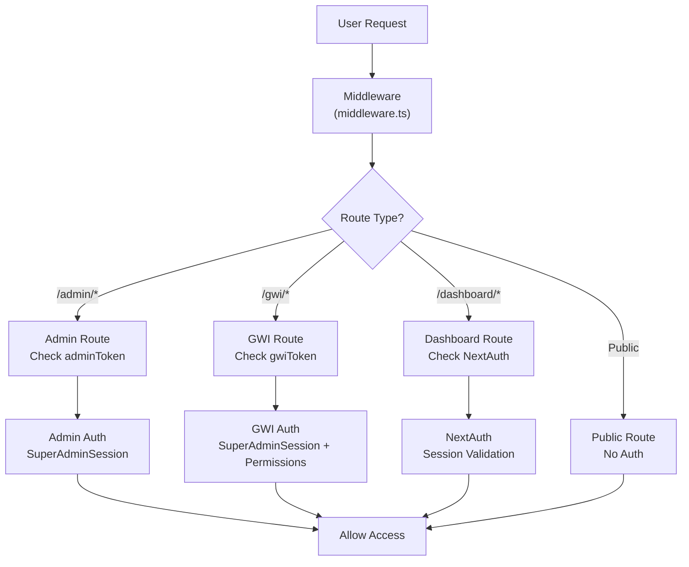
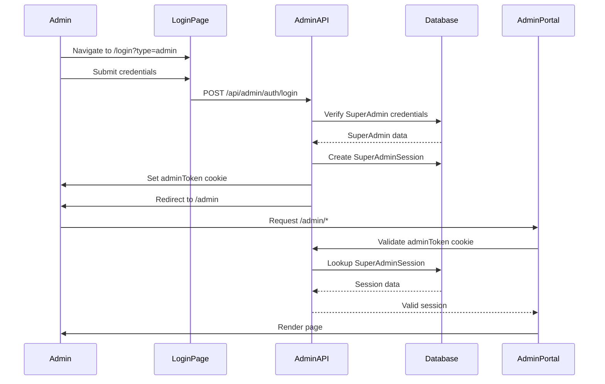
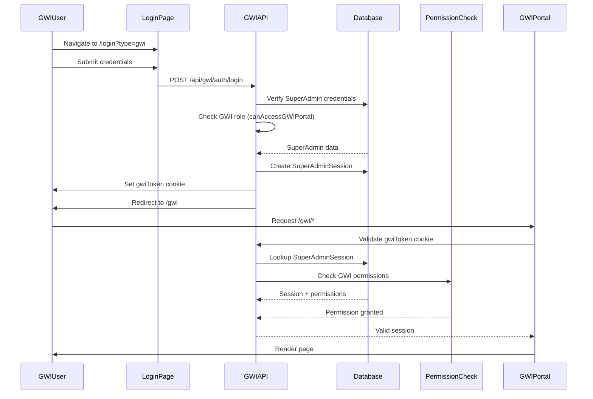
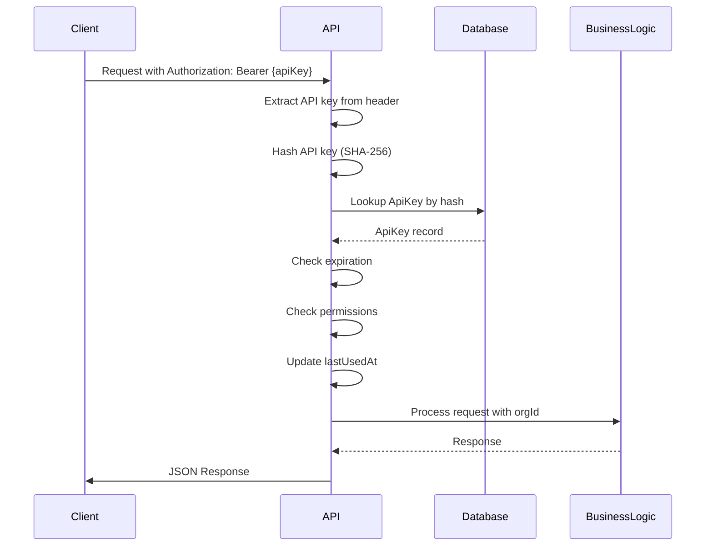

# Authentication & Authorization Architecture

**Version:** 1.0  
**Last Updated:** January 2026  
**Status:** Production Ready

---

## Table of Contents

1. [Overview](#overview)
2. [Three Authentication Systems](#three-authentication-systems)
3. [User Dashboard Authentication (NextAuth)](#user-dashboard-authentication-nextauth)
4. [Admin Portal Authentication](#admin-portal-authentication)
5. [GWI Portal Authentication](#gwi-portal-authentication)
6. [Role-Based Access Control (RBAC)](#role-based-access-control-rbac)
7. [Permission System](#permission-system)
8. [SSO/SAML Integration](#ssosaml-integration)
9. [API Key Authentication](#api-key-authentication)
10. [Security Best Practices](#security-best-practices)

---

## Overview

The platform implements **three separate authentication systems**, each optimized for different user types and security requirements:

1. **User Dashboard** - NextAuth.js for customer-facing portal
2. **Admin Portal** - Cookie-based authentication for platform administrators
3. **GWI Portal** - Cookie-based authentication for internal GWI team members

Each system has independent session management, allowing different timeout policies and security boundaries.

---

## Three Authentication Systems

### System Comparison

| Feature | User Dashboard | Admin Portal | GWI Portal |
|---------|---------------|--------------|------------|
| **Technology** | NextAuth.js v5 | Cookie-based | Cookie-based |
| **Session Storage** | JWT (cookies) | Database table | Database table |
| **Session Duration** | Configurable | 24 hours | 24 hours |
| **Providers** | Credentials, Google, Microsoft | Credentials only | Credentials only |
| **Session Table** | `Session` (NextAuth) | `SuperAdminSession` | `SuperAdminSession` |
| **Cookie Name** | `next-auth.session-token` | `adminToken` | `gwiToken` |
| **User Model** | `User` | `SuperAdmin` | `SuperAdmin` |
| **Roles** | OWNER, ADMIN, MEMBER, VIEWER | SUPER_ADMIN, ADMIN, SUPPORT, ANALYST | GWI_ADMIN, DATA_ENGINEER, etc. |

### Authentication Flow Overview



---

## User Dashboard Authentication (NextAuth)

### Technology Stack

- **Framework:** NextAuth.js v5 (beta)
- **Adapter:** Prisma Adapter
- **Session Strategy:** JWT (JSON Web Tokens)
- **Storage:** HTTP-only cookies

### Configuration

**File:** `lib/auth.ts`

```typescript
export const { handlers, auth, signIn, signOut } = NextAuth({
  adapter: PrismaAdapter(prisma),
  session: { strategy: "jwt" },
  trustHost: true,
  pages: {
    signIn: "/login",
    error: "/login",
  },
  providers: [
    Credentials({ /* ... */ }),
    Google({ /* ... */ }),
    MicrosoftEntraID({ /* ... */ }),
  ],
  callbacks: {
    async jwt({ token, user }) {
      if (user) {
        token.id = user.id
      }
      return token
    },
    async session({ session, token }) {
      if (token && session.user) {
        session.user.id = token.id as string
      }
      return session
    },
  },
})
```

### Authentication Providers

#### 1. Credentials Provider

**Email/Password Authentication:**

```typescript
Credentials({
  async authorize(credentials) {
    const user = await prisma.user.findUnique({
      where: { email: credentials.email }
    })
    
    const isValid = await bcrypt.compare(
      credentials.password,
      user.passwordHash
    )
    
    if (!isValid) return null
    
    return { id: user.id, email: user.email, name: user.name }
  }
})
```

**Password Security:**
- bcrypt hashing with 12 rounds
- Passwords never stored in plain text
- Secure password verification

#### 2. Google OAuth

**Configuration:**
- Requires `GOOGLE_CLIENT_ID` and `GOOGLE_CLIENT_SECRET`
- OAuth 2.0 flow
- Automatic account linking

#### 3. Microsoft Entra ID (Azure AD)

**Configuration:**
- Requires `AZURE_AD_CLIENT_ID`, `AZURE_AD_CLIENT_SECRET`, `AZURE_AD_TENANT_ID`
- OIDC flow
- Enterprise SSO support

### Session Management

**JWT Token Structure:**
```typescript
{
  id: string,        // User ID
  email: string,     // User email
  name: string,      // User name
  iat: number,       // Issued at
  exp: number        // Expiration
}
```

**Session Cookie:**
- Name: `next-auth.session-token`
- HTTP-only: Yes
- Secure: Yes (production)
- SameSite: Lax
- Max-Age: Configurable (default: 30 days)

### Usage in Code

**Server Components:**
```typescript
import { auth } from '@/lib/auth'

export default async function Page() {
  const session = await auth()
  
  if (!session?.user) {
    redirect('/login')
  }
  
  // Use session.user.id, session.user.email, etc.
}
```

**API Routes:**
```typescript
import { auth } from '@/lib/auth'

export async function GET(request: NextRequest) {
  const session = await auth()
  
  if (!session?.user?.id) {
    return NextResponse.json({ error: 'Unauthorized' }, { status: 401 })
  }
  
  // Process request with session.user.id
}
```

### Database Models

**User Model:**
```prisma
model User {
  id            String    @id @default(cuid())
  email         String    @unique
  name          String?
  passwordHash  String?
  emailVerified DateTime?
  // ...
  
  memberships OrganizationMember[]
  sessions    Session[]
  accounts    Account[]
}
```

**Session Model (NextAuth):**
```prisma
model Session {
  id           String   @id @default(cuid())
  sessionToken String   @unique
  userId       String
  expires      DateTime
  // ...
  
  user User @relation(...)
}
```

**Account Model (OAuth):**
```prisma
model Account {
  id                String  @id @default(cuid())
  userId            String
  type              String
  provider          String
  providerAccountId String
  // ...
  
  user User @relation(...)
}
```

---

## Admin Portal Authentication

### Technology Stack

- **Framework:** Custom cookie-based authentication
- **Session Storage:** `SuperAdminSession` database table
- **Cookie Name:** `adminToken`
- **User Model:** `SuperAdmin`

### Authentication Flow



### Implementation

**Login Endpoint:** `app/api/admin/auth/login/route.ts`

```typescript
export async function POST(request: NextRequest) {
  const { email, password } = await request.json()
  
  // Find admin
  const admin = await prisma.superAdmin.findUnique({
    where: { email: email.toLowerCase() }
  })
  
  // Verify password (supports bcrypt and legacy SHA256)
  const isValidPassword = await verifyPassword(password, admin.passwordHash)
  
  if (!isValidPassword) {
    return NextResponse.json({ error: "Invalid credentials" }, { status: 401 })
  }
  
  // Generate session token
  const token = randomBytes(32).toString("hex")
  const expiresAt = new Date(Date.now() + 24 * 60 * 60 * 1000) // 24 hours
  
  // Create session
  await prisma.superAdminSession.create({
    data: {
      token,
      adminId: admin.id,
      expiresAt,
      ipAddress,
      userAgent,
    }
  })
  
  // Set cookie and redirect
  const response = NextResponse.json({ success: true })
  response.cookies.set('adminToken', token, {
    httpOnly: true,
    secure: process.env.NODE_ENV === 'production',
    sameSite: 'lax',
    maxAge: 24 * 60 * 60, // 24 hours
  })
  
  return response
}
```

### Session Validation

**Function:** `lib/super-admin.ts` - `validateSuperAdminSession()`

```typescript
export async function validateSuperAdminSession(token: string) {
  const session = await prisma.superAdminSession.findUnique({
    where: { token },
    include: { admin: true }
  })
  
  if (!session || session.expiresAt < new Date() || !session.admin.isActive) {
    return null
  }
  
  return {
    admin: session.admin,
    session: session
  }
}
```

### Usage in Code

**API Routes:**
```typescript
import { cookies } from 'next/headers'
import { validateSuperAdminSession } from '@/lib/super-admin'

export async function GET(request: NextRequest) {
  const cookieStore = await cookies()
  const token = cookieStore.get('adminToken')?.value
  
  if (!token) {
    return NextResponse.json({ error: 'Unauthorized' }, { status: 401 })
  }
  
  const session = await validateSuperAdminSession(token)
  if (!session) {
    return NextResponse.json({ error: 'Unauthorized' }, { status: 401 })
  }
  
  // Use session.admin for admin operations
}
```

**Page Components:**
```typescript
import { cookies } from 'next/headers'
import { validateSuperAdminSession } from '@/lib/super-admin'
import { redirect } from 'next/navigation'

export default async function AdminPage() {
  const cookieStore = await cookies()
  const token = cookieStore.get('adminToken')?.value
  
  if (!token) {
    redirect('/login?type=admin')
  }
  
  const session = await validateSuperAdminSession(token)
  if (!session) {
    redirect('/login?type=admin')
  }
  
  // Render page with session.admin
}
```

### Database Models

**SuperAdmin Model:**
```prisma
model SuperAdmin {
  id          String   @id @default(cuid())
  email       String   @unique
  name        String?
  passwordHash String
  role        SuperAdminRole
  isActive    Boolean  @default(true)
  // ...
  
  sessions SuperAdminSession[]
}

enum SuperAdminRole {
  SUPER_ADMIN
  ADMIN
  SUPPORT
  ANALYST
  GWI_ADMIN
  DATA_ENGINEER
  TAXONOMY_MANAGER
  ML_ENGINEER
}
```

**SuperAdminSession Model:**
```prisma
model SuperAdminSession {
  id        String   @id @default(cuid())
  token     String   @unique
  adminId   String
  expiresAt DateTime
  ipAddress String?
  userAgent String?
  createdAt DateTime @default(now())
  
  admin SuperAdmin @relation(...)
  
  @@index([token])
  @@index([adminId])
  @@index([expiresAt])
}
```

### Password Verification

**Supports Both Bcrypt and Legacy SHA256:**

```typescript
export async function verifyPassword(
  password: string,
  hash: string
): Promise<boolean> {
  // Try bcrypt first
  try {
    return await bcrypt.compare(password, hash)
  } catch {
    // Fall back to SHA256 for legacy passwords
    const sha256Hash = createHash('sha256').update(password).digest('hex')
    return sha256Hash === hash
  }
}
```

---

## GWI Portal Authentication

### Technology Stack

- **Framework:** Custom cookie-based authentication (shared with admin)
- **Session Storage:** `SuperAdminSession` database table
- **Cookie Name:** `gwiToken`
- **User Model:** `SuperAdmin` (with GWI-specific roles)
- **Additional:** Permission-based access control

### Authentication Flow

Similar to Admin Portal, but with additional permission checks:



### GWI Roles

**Allowed Roles:**
- `GWI_ADMIN` - Full GWI portal access
- `DATA_ENGINEER` - Pipeline and data source management
- `TAXONOMY_MANAGER` - Survey and taxonomy management
- `ML_ENGINEER` - LLM and agent configuration
- `SUPER_ADMIN` - Full access everywhere

**Access Check:**
```typescript
// lib/gwi-permissions.ts
export function canAccessGWIPortal(role: SuperAdminRole): boolean {
  const allowedRoles: SuperAdminRole[] = [
    'SUPER_ADMIN',
    'GWI_ADMIN',
    'DATA_ENGINEER',
    'TAXONOMY_MANAGER',
    'ML_ENGINEER',
  ]
  return allowedRoles.includes(role)
}
```

### Permission System

**GWI Permissions:** `lib/gwi-permissions.ts`

```typescript
export const GWI_PERMISSIONS = {
  'surveys:read': 'View surveys',
  'surveys:write': 'Create and edit surveys',
  'taxonomy:read': 'View taxonomy',
  'pipelines:read': 'View pipelines',
  'pipelines:write': 'Create and edit pipelines',
  'llm:read': 'View LLM configurations',
  'llm:write': 'Manage LLM configurations',
  // ... more permissions
  'gwi:*': 'Full GWI portal access',
}
```

**Permission Check:**
```typescript
export function hasGWIPermission(
  role: SuperAdminRole,
  permission: GWIPermission
): boolean {
  const permissions = GWI_ROLE_PERMISSIONS[role] || []
  if (permissions.includes('gwi:*')) return true
  return permissions.includes(permission)
}
```

### Usage in Code

**API Routes:**
```typescript
import { cookies } from 'next/headers'
import { validateSuperAdminSession } from '@/lib/super-admin'
import { hasGWIPermission } from '@/lib/gwi-permissions'

export async function GET(request: NextRequest) {
  const cookieStore = await cookies()
  const token = cookieStore.get('gwiToken')?.value
  
  if (!token) {
    return NextResponse.json({ error: 'Unauthorized' }, { status: 401 })
  }
  
  const session = await validateSuperAdminSession(token)
  if (!session) {
    return NextResponse.json({ error: 'Unauthorized' }, { status: 401 })
  }
  
  // Check GWI permissions
  if (!hasGWIPermission(session.admin.role, 'surveys:read')) {
    return NextResponse.json({ error: 'Forbidden' }, { status: 403 })
  }
  
  // Process request
}
```

---

## Role-Based Access Control (RBAC)

### User Dashboard Roles

**Organization-Level Roles:**

| Role | Permissions |
|------|-------------|
| `OWNER` | Full control, can delete organization, manage billing |
| `ADMIN` | Manage members, settings, all resources |
| `MEMBER` | Create and edit resources, view team |
| `VIEWER` | Read-only access to resources |

**Role Assignment:**
- Stored in `OrganizationMember` model
- User can have different roles in different organizations
- Roles scoped to organization

### Admin Portal Roles

**SuperAdmin Roles:**

| Role | Description | Key Permissions |
|------|-------------|-----------------|
| `SUPER_ADMIN` | Full platform access | All permissions |
| `ADMIN` | Platform administration | Tenant management, user management, analytics |
| `SUPPORT` | Support operations | View tenants, users, support tickets |
| `ANALYST` | Analytics access | View analytics, export data |

### GWI Portal Roles

**GWI-Specific Roles:**

| Role | Description | Key Permissions |
|------|-------------|-----------------|
| `GWI_ADMIN` | Full GWI portal access | All GWI permissions |
| `DATA_ENGINEER` | Pipeline management | Pipelines, data sources, monitoring |
| `TAXONOMY_MANAGER` | Data classification | Surveys, taxonomy |
| `ML_ENGINEER` | AI configuration | LLMs, agents, prompts |

---

## Permission System

### Permission Format

**Pattern:** `resource:action`

**Examples:**
- `agents:read` - View agents
- `agents:write` - Create/edit agents
- `agents:delete` - Delete agents
- `agents:execute` - Run agents

### User Dashboard Permissions

**File:** `lib/permissions.ts`

**Permission Categories:**
- Agents (`agents:*`)
- Workflows (`workflows:*`)
- Reports (`reports:*`)
- Dashboards (`dashboards:*`)
- Audiences (`audiences:*`)
- Team (`team:*`)
- Security (`security:*`)
- API Keys (`apiKeys:*`)
- And more...

**Role-Permission Mapping:**
```typescript
export const ROLE_PERMISSIONS: Record<Role, Permission[]> = {
  OWNER: ['*'],  // All permissions
  ADMIN: [
    'agents:*',
    'workflows:*',
    'reports:*',
    'team:*',
    // ... more permissions
  ],
  MEMBER: [
    'agents:read', 'agents:write', 'agents:execute',
    'workflows:read', 'workflows:write', 'workflows:execute',
    // ... limited permissions
  ],
  VIEWER: [
    'agents:read',
    'workflows:read',
    'reports:read',
    // ... read-only permissions
  ],
}
```

**Permission Check:**
```typescript
export function hasPermission(role: Role, permission: Permission): boolean {
  const permissions = ROLE_PERMISSIONS[role] || []
  if (permissions.includes('*')) return true
  return permissions.includes(permission)
}
```

### Usage in Code

**API Routes:**
```typescript
import { hasPermission } from '@/lib/permissions'

export async function GET(request: NextRequest) {
  const session = await auth()
  const membership = await getUserMembership(session.user.id, orgId)
  
  if (!hasPermission(membership.role, 'agents:read')) {
    return NextResponse.json({ error: 'Forbidden' }, { status: 403 })
  }
  
  // Process request
}
```

---

## SSO/SAML Integration

### Supported Providers

- **SAML 2.0** - Generic SAML providers
- **OIDC** - OpenID Connect
- **Azure AD** - Microsoft Entra ID
- **Google Workspace** - Google SSO
- **Okta** - Okta SSO
- **OneLogin** - OneLogin SSO

### Configuration Model

**SSOConfiguration:**
```prisma
model SSOConfiguration {
  id                String   @id @default(cuid())
  orgId             String   @unique
  provider          SSOProvider
  status            SSOStatus @default(INACTIVE)
  metadataUrl       String?
  metadataXml       String?  @db.Text
  entityId          String?
  ssoUrl            String?
  certificate       String?  @db.Text
  // ...
  
  organization Organization @relation(...)
}

enum SSOProvider {
  SAML_GENERIC
  AZURE_AD
  GOOGLE_WORKSPACE
  OKTA
  ONELOGIN
  OIDC_GENERIC
}
```

### Enterprise SSO

**EnterpriseSSO Model:**
```prisma
model EnterpriseSSO {
  id              String   @id @default(cuid())
  orgId           String
  provider        SSOProvider
  status          SSOStatus
  // Advanced configuration
  attributeMapping Json     // User attribute mapping
  groupMapping    Json     // Group/role mapping
  // ...
}
```

### SCIM Provisioning

**SCIMIntegration Model:**
```prisma
model SCIMIntegration {
  id          String   @id @default(cuid())
  orgId       String
  status      SCIMStatus
  scimUrl     String
  bearerToken String   // Encrypted
  // ...
}
```

**Features:**
- Automatic user provisioning
- User deprovisioning
- Group synchronization
- Role mapping

---

## API Key Authentication

### API Key Model

```prisma
model ApiKey {
  id          String   @id @default(cuid())
  orgId       String
  name        String
  hashedKey   String   // SHA-256 hash
  prefix      String   // First 8 chars for identification
  permissions Json     // Permission scopes
  expiresAt   DateTime?
  lastUsedAt  DateTime?
  createdAt   DateTime @default(now())
  
  organization Organization @relation(...)
  user         User         @relation(...)
  
  @@index([orgId])
  @@index([prefix])
}
```

### Authentication Flow



### Usage

**Request:**
```bash
curl -H "Authorization: Bearer gwi_abc123..." \
     -H "x-organization-id: org_123" \
     https://api.example.com/v1/agents
```

**API Route:**
```typescript
export async function GET(request: NextRequest) {
  const authHeader = request.headers.get('authorization')
  const apiKey = authHeader?.replace('Bearer ', '')
  
  if (!apiKey) {
    return NextResponse.json({ error: 'Unauthorized' }, { status: 401 })
  }
  
  const hashedKey = createHash('sha256').update(apiKey).digest('hex')
  const keyRecord = await prisma.apiKey.findFirst({
    where: { hashedKey }
  })
  
  if (!keyRecord || keyRecord.expiresAt < new Date()) {
    return NextResponse.json({ error: 'Invalid API key' }, { status: 401 })
  }
  
  // Check permissions
  const permissions = keyRecord.permissions as string[]
  if (!permissions.includes('agents:read')) {
    return NextResponse.json({ error: 'Forbidden' }, { status: 403 })
  }
  
  // Process request with keyRecord.orgId
}
```

---

## Security Best Practices

### Password Security

1. **Hashing:** bcrypt with 12 rounds
2. **Verification:** Constant-time comparison
3. **Storage:** Never store plain text passwords
4. **Legacy Support:** SHA256 fallback for migration

### Session Security

1. **HTTP-Only Cookies:** Prevent XSS attacks
2. **Secure Flag:** HTTPS only in production
3. **SameSite:** Lax for CSRF protection
4. **Expiration:** Reasonable session timeouts
5. **Rotation:** Session token rotation on privilege changes

### API Security

1. **Rate Limiting:** Per-organization and per-user limits
2. **API Key Prefixes:** Easy identification and revocation
3. **Key Expiration:** Optional expiration dates
4. **Permission Scoping:** Fine-grained permissions per key
5. **Usage Tracking:** Monitor API key usage

### Multi-Tenancy Security

1. **Data Isolation:** All queries scoped to organization
2. **Membership Validation:** Always verify user membership
3. **Cross-Org Access:** Explicitly tracked and audited
4. **Resource Sharing:** Explicit sharing model

### Audit Logging

1. **Authentication Events:** Login, logout, failed attempts
2. **Authorization Events:** Permission checks, denied access
3. **Data Access:** Resource access tracking
4. **Configuration Changes:** Settings modifications

---

## Related Documentation

- [System Overview](./SYSTEM_OVERVIEW.md) - High-level platform overview
- [Application Architecture](./APPLICATION_ARCHITECTURE.md) - Application structure
- [Database Architecture](./DATABASE_ARCHITECTURE.md) - Database schema
- [Security Architecture](../security/SECURITY_ARCHITECTURE.md) - Security details
- [API Overview](../api/API_OVERVIEW.md) - API authentication

---

**Last Updated:** January 2026  
**Maintained By:** Engineering Team
