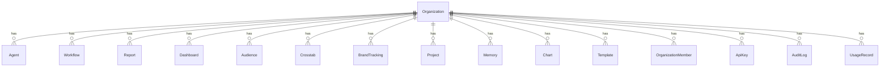
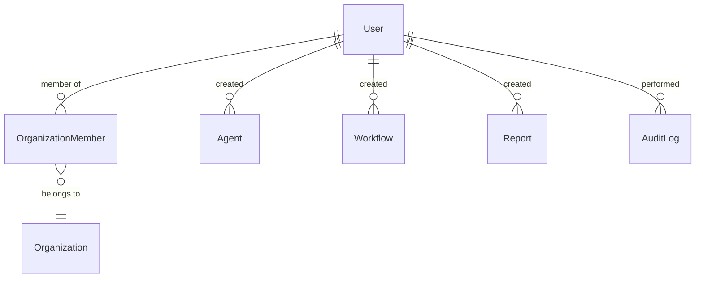
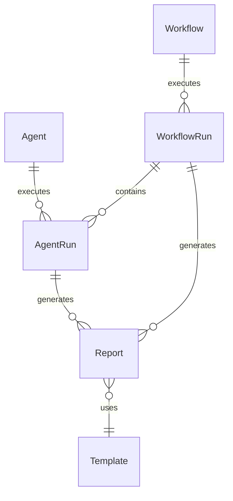

# Database Architecture

**Version:** 1.0  
**Last Updated:** January 2026  
**Status:** Production Ready

---

## Table of Contents

1. [Overview](#overview)
2. [Database Technology](#database-technology)
3. [Schema Statistics](#schema-statistics)
4. [Multi-Tenancy Implementation](#multi-tenancy-implementation)
5. [Organization Hierarchy System](#organization-hierarchy-system)
6. [Core Entity Relationships](#core-entity-relationships)
7. [Indexing Strategy](#indexing-strategy)
8. [Migration Patterns](#migration-patterns)
9. [Data Model Categories](#data-model-categories)

---

## Overview

The platform uses **PostgreSQL** as the primary database with **Prisma ORM** for type-safe database access. The schema consists of **149 models** covering all platform features including multi-tenancy, organization hierarchies, AI agents, workflows, reports, enterprise features, and GWI portal functionality.

### Key Design Principles

1. **Multi-Tenancy First** - All customer data scoped to organizations
2. **Hierarchical Organizations** - Support for complex org structures
3. **Type Safety** - Prisma provides end-to-end type safety
4. **Audit Trail** - Comprehensive audit logging for compliance
5. **Flexible Schema** - JSON fields for extensibility
6. **Performance** - Strategic indexing for query optimization

---

## Database Technology

### PostgreSQL

- **Version:** Latest stable (managed via Neon/Supabase or self-hosted)
- **Features Used:**
  - JSON/JSONB columns for flexible data storage
  - Full-text search capabilities
  - Foreign key constraints
  - Indexes (B-tree, GIN for JSON)
  - Transactions and ACID compliance

### Prisma ORM

- **Version:** 5.22.0
- **Features:**
  - Type-safe database client
  - Migration management
  - Schema introspection
  - Relationship modeling
  - Query optimization

**Reference:** `prisma/schema.prisma`

---

## Schema Statistics

### Model Count

- **Total Models:** 149
- **Core Models:** ~30 (Organization, User, Agent, Workflow, etc.)
- **Enterprise Models:** ~40 (Hierarchy, SSO, Compliance, Billing)
- **GWI Models:** ~20 (Surveys, Taxonomy, Pipelines, LLM)
- **Supporting Models:** ~59 (Audit, Analytics, Notifications, etc.)

### Enum Count

- **Total Enums:** 131
- **Status Enums:** ~30 (AgentStatus, WorkflowStatus, etc.)
- **Type Enums:** ~25 (AgentType, ReportType, etc.)
- **Permission Enums:** ~15 (Role, PlanTier, etc.)
- **Other Enums:** ~61 (various domain-specific enums)

---

## Multi-Tenancy Implementation

### Organization-Scoped Data

**Principle:** All customer-facing resources are scoped to an organization via `orgId` foreign key.

**Example Models:**
```prisma
model Agent {
  id        String   @id @default(cuid())
  orgId     String   // Organization scope
  name      String
  // ...
  
  organization Organization @relation(fields: [orgId], references: [id])
}

model Workflow {
  id        String   @id @default(cuid())
  orgId     String   // Organization scope
  name      String
  // ...
  
  organization Organization @relation(fields: [orgId], references: [id])
}
```

### Data Isolation

**Enforcement:**
1. **Application Level:** All queries filtered by `orgId`
2. **Database Level:** Foreign key constraints ensure referential integrity
3. **API Level:** `getValidatedOrgId()` validates user membership before queries

**Pattern:**
```typescript
// lib/tenant.ts
export async function getValidatedOrgId(
  request: NextRequest, 
  userId: string
): Promise<string | null> {
  // 1. Get user's organization memberships
  const memberships = await prisma.organizationMember.findMany({
    where: { userId }
  })
  
  // 2. Validate requested orgId is in user's memberships
  const headerOrgId = request.headers.get('x-organization-id')
  if (headerOrgId && memberships.some(m => m.orgId === headerOrgId)) {
    return headerOrgId
  }
  
  // 3. Fall back to first organization
  return memberships[0]?.orgId ?? null
}
```

### Organization Membership

**Model:** `OrganizationMember`

```prisma
model OrganizationMember {
  id        String   @id @default(cuid())
  orgId     String
  userId    String
  role      Role     @default(MEMBER)
  invitedBy String?
  joinedAt  DateTime @default(now())

  organization Organization @relation(...)
  user         User         @relation(...)

  @@unique([orgId, userId])
  @@index([orgId])
  @@index([userId])
}
```

**Roles:**
- `OWNER` - Full control, can delete organization
- `ADMIN` - Manage members, settings, resources
- `MEMBER` - Create and edit resources
- `VIEWER` - Read-only access

---

## Organization Hierarchy System

The platform supports complex multi-level organizational structures for enterprise customers.

### Hierarchy Fields

```prisma
model Organization {
  // Hierarchy fields
  parentOrgId    String?  // Direct parent
  rootOrgId      String?  // Top-level org (for quick queries)
  hierarchyPath  String   @default("/") // Materialized path
  hierarchyLevel Int      @default(0)    // Depth (0 = root)
  maxChildDepth  Int      @default(5)    // Max allowed depth
  displayOrder   Int      @default(0)    // Sibling ordering
  
  // Hierarchy relationships
  parentOrg      Organization?  @relation("OrgHierarchy", ...)
  childOrgs      Organization[] @relation("OrgHierarchy")
  rootOrg        Organization?  @relation("RootOrgRef", ...)
  descendantOrgs Organization[] @relation("RootOrgRef")
}
```

### Materialized Path Pattern

**`hierarchyPath`** stores the full path from root to current org:
- Example: `/rootId/parentId/currentId/`
- Enables efficient queries for descendants
- Single query to get all children: `WHERE hierarchyPath LIKE '/rootId/%'`

### Organization Types

```prisma
enum OrganizationType {
  STANDARD        // Default individual organization
  AGENCY          // Marketing/advertising agency
  HOLDING_COMPANY // Parent company
  SUBSIDIARY      // Company owned by holding company
  BRAND           // Individual brand entity
  SUB_BRAND       // Sub-brand under parent brand
  DIVISION        // Business division
  DEPARTMENT      // Department within division
  FRANCHISE       // Franchise organization
  FRANCHISEE      // Individual franchise location
  RESELLER        // Partner that resells
  CLIENT          // Client organization
  REGIONAL        // Regional entity (EMEA, APAC)
  PORTFOLIO_COMPANY // PE/VC portfolio company
}
```

### Hierarchy Relationships

**Cross-Organization Relationships:**

```prisma
model OrgRelationship {
  id               String              @id @default(cuid())
  fromOrgId        String
  toOrgId          String
  relationshipType OrgRelationshipType
  status           RelationshipStatus  @default(PENDING)
  
  // Permissions
  permissions Json
  accessLevel ResourceSharingScope
  
  // Billing
  billingRelation BillingRelationship
  billingConfig   Json
  
  fromOrg Organization @relation("RelationshipFrom", ...)
  toOrg   Organization @relation("RelationshipTo", ...)
}
```

**Relationship Types:**
- `OWNERSHIP` - Full ownership
- `MANAGEMENT` - Management access
- `PARTNERSHIP` - Collaboration
- `LICENSING` - Licensing agreement
- `RESELLER` - Reseller relationship
- `WHITE_LABEL` - White-label partnership
- `DATA_SHARING` - Data sharing only

### Resource Sharing

**Shared Resources:**

```prisma
model SharedResourceAccess {
  id           String               @id @default(cuid())
  ownerOrgId   String              // Resource owner
  targetOrgId  String              // Organization granted access
  resourceType SharedResourceType
  resourceId   String?             // Specific resource or null for all
  accessLevel  ResourceSharingScope
  
  canView   Boolean @default(true)
  canEdit   Boolean @default(false)
  canDelete Boolean @default(false)
  canShare  Boolean @default(false)
  
  propagateToChildren Boolean @default(false)
  expiresAt DateTime?
  isActive  Boolean   @default(true)
}
```

**Resource Types:**
- `TEMPLATE` - Report/dashboard templates
- `AUDIENCE` - Audience definitions
- `DATA_SOURCE` - Data source configurations
- `BRAND_TRACKING` - Brand tracking setups
- `WORKFLOW` - Workflow configurations
- `AGENT` - AI agent configurations
- `CHART` - Chart configurations
- `ALL` - All resource types

---

## Core Entity Relationships

### Organization → Resources



### User → Organization Membership



### Agent → Workflow → Report Flow



### Core Models

**Agent System:**
- `Agent` - Agent definitions
- `AgentRun` - Individual agent executions
- `Workflow` - Multi-step workflows
- `WorkflowRun` - Workflow executions

**Reporting:**
- `Report` - Generated reports
- `Dashboard` - Custom dashboards
- `Chart` - Chart configurations
- `Template` - Report/dashboard templates

**Data Analysis:**
- `Audience` - Audience definitions
- `Crosstab` - Cross-tabulation analysis
- `BrandTracking` - Brand monitoring
- `Insight` - Generated insights

**Collaboration:**
- `Project` - Project workspaces
- `Comment` - Comments on resources
- `SharedLink` - Public sharing links
- `SavedView` - Saved filter presets

**Memory & Context:**
- `Memory` - Persistent memory storage
- `ToolMemory` - Tool-specific memory

---

## Indexing Strategy

### Primary Indexes

**Organization Scoping:**
```prisma
model Agent {
  orgId String
  
  @@index([orgId])  // Fast org-scoped queries
}
```

**User Membership:**
```prisma
model OrganizationMember {
  orgId  String
  userId String
  
  @@unique([orgId, userId])  // Prevent duplicates
  @@index([orgId])            // Fast org member queries
  @@index([userId])          // Fast user org queries
}
```

**Hierarchy Queries:**
```prisma
model Organization {
  parentOrgId String?
  rootOrgId   String?
  hierarchyPath String
  
  @@index([parentOrgId])   // Parent queries
  @@index([rootOrgId])     // Root queries
  @@index([hierarchyPath]) // Path queries (LIKE)
}
```

### Composite Indexes

**Common Query Patterns:**
```prisma
model AgentRun {
  agentId String
  orgId   String
  status  AgentRunStatus
  createdAt DateTime
  
  @@index([orgId, status])        // Org + status filter
  @@index([agentId, createdAt])   // Agent history
  @@index([orgId, createdAt])     // Org activity
}
```

### Foreign Key Indexes

Prisma automatically creates indexes on foreign keys, but explicit indexes are added for:
- Frequently queried relationships
- Multi-column queries
- Sorting operations

---

## Migration Patterns

### Migration Workflow

1. **Modify Schema:** Edit `prisma/schema.prisma`
2. **Create Migration:** `npx prisma migrate dev --name migration_name`
3. **Review SQL:** Check generated SQL in `prisma/migrations/`
4. **Apply Migration:** `npx prisma migrate deploy` (production)

### Migration Best Practices

**Breaking Changes:**
- Add new fields as optional first
- Migrate data before making required
- Use `@default()` for new required fields

**Performance:**
- Add indexes in separate migrations
- Use `@@map` for table renames
- Batch large data migrations

**Rollback:**
- Keep migration files for rollback
- Test migrations on staging first
- Use transactions for data migrations

### Example Migration

```prisma
// Add new field
model Agent {
  // ... existing fields
  newField String?  // Optional first
}

// Migration SQL
ALTER TABLE "Agent" ADD COLUMN "newField" TEXT;

// Later: Make required
model Agent {
  newField String @default("default-value")
}

// Migration SQL
ALTER TABLE "Agent" ALTER COLUMN "newField" SET NOT NULL;
ALTER TABLE "Agent" ALTER COLUMN "newField" SET DEFAULT 'default-value';
```

---

## Data Model Categories

### 1. Multi-Tenancy & Organization

**Models:**
- `Organization` - Core tenant model
- `OrganizationMember` - User-org relationships
- `OrgRelationship` - Cross-org relationships
- `SharedResourceAccess` - Resource sharing
- `RoleInheritanceRule` - Role inheritance
- `HierarchyAuditLog` - Hierarchy changes
- `HierarchyTemplate` - Org structure templates
- `CrossOrgInvitation` - Cross-org invitations

### 2. Authentication & Authorization

**Models:**
- `User` - User accounts
- `Account` - OAuth accounts
- `Session` - NextAuth sessions
- `SuperAdmin` - Admin/GWI users
- `SuperAdminSession` - Admin/GWI sessions
- `ApiKey` - API key authentication
- `SSOConfiguration` - SSO settings
- `EnterpriseSSO` - Enterprise SSO
- `SCIMIntegration` - SCIM provisioning
- `TrustedDevice` - Device trust
- `DevicePolicy` - Device policies

### 3. AI Agent System

**Models:**
- `Agent` - Agent definitions
- `AgentRun` - Agent executions
- `Workflow` - Workflow definitions
- `WorkflowRun` - Workflow executions
- `SystemAgentTemplate` - Agent templates
- `SystemToolConfiguration` - Tool configs

### 4. Reporting & Visualization

**Models:**
- `Report` - Generated reports
- `Dashboard` - Custom dashboards
- `Chart` - Chart configurations
- `Template` - Report/dashboard templates
- `CustomReport` - Custom report types

### 5. Data Analysis

**Models:**
- `Audience` - Audience definitions
- `Crosstab` - Cross-tabulation analysis
- `BrandTracking` - Brand monitoring
- `BrandTrackingSnapshot` - Brand snapshots
- `Insight` - Generated insights
- `DataSource` - Data source connections
- `DataConnector` - Data connectors

### 6. Memory & Context

**Models:**
- `Memory` - Persistent memory
- `ToolMemory` - Tool-specific memory

### 7. Collaboration

**Models:**
- `Project` - Project workspaces
- `Comment` - Comments
- `SharedLink` - Public sharing
- `SharedLinkView` - Link view tracking
- `SavedView` - Saved filters

### 8. Enterprise Features

**Models:**
- `BillingSubscription` - Subscriptions
- `Plan` - Plan definitions
- `Feature` - Feature definitions
- `PlanFeature` - Plan-feature mapping
- `TenantEntitlement` - Org entitlements
- `FeatureFlag` - Feature flags

### 9. Security & Compliance

**Models:**
- `SecurityPolicy` - Security policies
- `SecurityViolation` - Policy violations
- `ThreatEvent` - Threat events
- `IPBlocklist` - IP blocking
- `ComplianceFramework` - Compliance frameworks
- `ComplianceAttestation` - Attestations
- `ComplianceAudit` - Compliance audits
- `LegalHold` - Legal holds
- `DataExport` - Data exports
- `DataRetentionPolicy` - Retention policies

### 10. Audit & Monitoring

**Models:**
- `AuditLog` - General audit logs
- `PlatformAuditLog` - Platform audit logs
- `GWIAuditLog` - GWI audit logs
- `PortalAuditLog` - Portal audit logs
- `RoleAuditLog` - Role changes
- `UsageRecord` - Usage tracking
- `AnalyticsSnapshot` - Analytics snapshots

### 11. GWI Portal

**Models:**
- `Survey` - Surveys
- `SurveyQuestion` - Survey questions
- `SurveyResponse` - Survey responses
- `SurveyDistribution` - Survey distribution
- `TaxonomyCategory` - Taxonomy categories
- `TaxonomyAttribute` - Taxonomy attributes
- `TaxonomyMappingRule` - Mapping rules
- `DataPipeline` - Data pipelines
- `PipelineRun` - Pipeline executions
- `LLMConfiguration` - LLM configs
- `PromptTemplate` - Prompt templates
- `LLMUsageRecord` - LLM usage
- `GWIDataSourceConnection` - GWI data sources
- `GWIMonitoringAlert` - Monitoring alerts
- `GWIErrorLog` - Error logs
- `GWIPortalSettings` - Portal settings
- `GWIApiKey` - GWI API keys

### 12. Support & Operations

**Models:**
- `SupportTicket` - Support tickets
- `TicketResponse` - Ticket responses
- `PlatformIncident` - Platform incidents
- `IncidentUpdate` - Incident updates
- `MaintenanceWindow` - Maintenance windows
- `ReleaseManagement` - Release tracking
- `CapacityMetric` - Capacity metrics

### 13. Notifications & Communication

**Models:**
- `SystemNotification` - System notifications
- `BroadcastMessage` - Broadcast messages
- `CustomAlert` - Custom alerts
- `AlertHistory` - Alert history
- `EmailTemplate` - Email templates
- `EmailTemplateVersion` - Template versions

### 14. User Experience

**Models:**
- `UserPreferences` - User preferences
- `FeedbackItem` - User feedback
- `NPSSurvey` - NPS surveys
- `NPSResponse` - NPS responses
- `SavedView` - Saved views
- `ScheduledExport` - Scheduled exports
- `ExportHistory` - Export history

### 15. Integrations

**Models:**
- `IntegrationApp` - Integration apps
- `IntegrationInstall` - App installations
- `WebhookEndpoint` - Webhook endpoints
- `WebhookDelivery` - Webhook deliveries
- `APIClient` - API clients

---

## Related Documentation

- [System Overview](./SYSTEM_OVERVIEW.md) - High-level platform overview
- [Application Architecture](./APPLICATION_ARCHITECTURE.md) - Application structure
- [Authentication Architecture](./AUTH_ARCHITECTURE.md) - Auth systems
- [Core Data Models](../data-models/CORE_MODELS.md) - Detailed model documentation
- [Enterprise Data Models](../data-models/ENTERPRISE_MODELS.md) - Enterprise models
- [GWI Data Models](../data-models/GWI_MODELS.md) - GWI portal models
- [Development Setup](../development/SETUP.md) - Database setup guide

---

**Last Updated:** January 2026  
**Maintained By:** Engineering Team
