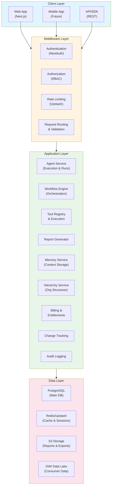

# System Overview

**Version:** 1.0  
**Last Updated:** January 2026  
**Status:** Production Ready

---

## Table of Contents

1. [Platform Purpose](#platform-purpose)
2. [Three-Portal Architecture](#three-portal-architecture)
3. [Technology Stack](#technology-stack)
4. [High-Level Component Diagram](#high-level-component-diagram)
5. [Key Design Decisions](#key-design-decisions)
6. [Platform Capabilities](#platform-capabilities)

---

## Platform Purpose

### What is GWI AI Agent Framework?

The **GWI AI Agent Framework** is an enterprise SaaS platform that transforms consumer research data into actionable insights through AI-powered agents. It is a multi-tenant research intelligence platform that enables organizations to:

- **Automate complex research workflows** through intelligent agent orchestration
- **Generate verified, cited insights** with full data provenance tracking
- **Collaborate at enterprise scale** with role-based access control and team management
- **Integrate with GWI's research data** (Global Web Index) for consumer intelligence
- **Build custom AI agents** for specialized research tasks

### Core Value Proposition

1. **Automated Research Workflows** - Multi-step agent pipelines execute complex research autonomously
2. **Verified Insights** - Every output includes citations, confidence scores, and data provenance
3. **Enterprise Collaboration** - Team workspaces, projects, and granular role-based access control
4. **Extensible Agent System** - Pre-built domain agents plus custom agent creation capabilities
5. **Advanced Organization Hierarchy** - Support for complex multi-level organizational structures (agencies, holding companies, franchises, etc.)
6. **Enterprise Security & Compliance** - SSO, SCIM, device trust, security policies, and full compliance framework

### Target Users

- **Research Analysts** - Generate audience profiles, track trends, create client deliverables
- **Insights Managers** - Oversee team output, ensure quality standards, manage client relationships
- **Data Engineers** - Build custom integrations, create specialized agents, maintain data pipelines
- **Marketing Strategists** - Receive actionable audience insights, understand consumer behavior
- **Enterprise Administrators** - Manage access, ensure compliance, monitor usage

---

## Three-Portal Architecture

The platform consists of three distinct portals, each serving different user types and use cases:

### 1. User Dashboard (`/dashboard/*`)

**Purpose:** Customer-facing portal for data analysis and research

**Authentication:** NextAuth.js v5 (JWT sessions)

**Key Features:**
- Agent Playground (interactive AI chat)
- Workflow management and execution
- Report generation and viewing
- Dashboard customization
- Audience analysis
- Brand tracking
- Crosstab analysis
- Project collaboration
- Team management

**Access Control:** Organization-scoped with role-based permissions (OWNER, ADMIN, MEMBER, VIEWER)

**Technology:**
- Next.js App Router with Server Components
- React Server Components for data fetching
- SWR for client-side data synchronization
- Real-time updates via polling/SSE

### 2. Admin Portal (`/admin/*`)

**Purpose:** Platform administration for managing tenants, users, and platform operations

**Authentication:** Cookie-based (`adminToken`)

**Key Features:**
- Tenant management (organizations)
- User management across tenants
- Analytics and usage monitoring
- Compliance and audit logs
- Security policy management
- Feature flag management
- Billing and subscription management
- Health score monitoring
- Support ticket management

**Access Control:** SuperAdmin roles (SUPER_ADMIN, ADMIN, SUPPORT)

**Technology:**
- Separate authentication system from user dashboard
- Session stored in `SuperAdminSession` table
- Permission checks via `lib/super-admin.ts`

### 3. GWI Team Portal (`/gwi/*`)

**Purpose:** Internal tools for GWI team members to manage core data operations

**Authentication:** Cookie-based (`gwiToken`)

**Key Features:**
- Survey management (create and manage research surveys)
- Taxonomy management (data classification and standardization)
- Data pipeline configuration (ETL processes)
- LLM configuration (AI model settings and prompts)
- Agent template management
- Data source connections
- Monitoring and alerting

**Access Control:** GWI-specific roles (GWI_ADMIN, DATA_ENGINEER, TAXONOMY_MANAGER, ML_ENGINEER)

**Technology:**
- Shared authentication infrastructure with admin portal
- Permission-based access via `lib/gwi-permissions.ts`
- GWI-specific audit logging

---

## Technology Stack

### Frontend

| Component | Technology | Version | Purpose |
|-----------|------------|---------|---------|
| Framework | Next.js | 16.0.10 | App Router with Server Components |
| Language | TypeScript | 5.x | Type-safe development |
| UI Components | shadcn/ui + Radix UI | Latest | Accessible, customizable components |
| Styling | Tailwind CSS | 4.1.9 | Utility-first CSS framework |
| Forms | React Hook Form + Zod | Latest | Type-safe form validation |
| Charts | Recharts | 2.15.4 | Data visualization |
| State Management | React Context + SWR | Latest | Server state synchronization |
| Internationalization | next-intl | 4.7.0 | Multi-language support (11 languages) |

### Backend

| Component | Technology | Version | Purpose |
|-----------|------------|---------|---------|
| Runtime | Node.js | 20 LTS | Server runtime |
| API Framework | Next.js Route Handlers | 16.0.10 | REST API endpoints |
| Database ORM | Prisma | 5.22.0 | Type-safe database access |
| Database | PostgreSQL | Latest | Primary data store |
| Cache | Redis/Upstash | Latest | Session storage, rate limiting |
| Authentication | NextAuth.js | 5.0.0-beta.25 | User authentication |
| Password Hashing | bcryptjs | 2.4.3 | Secure password storage |

### AI/ML Integration

| Component | Technology | Purpose |
|-----------|------------|---------|
| Primary LLM | Anthropic Claude | AI agent execution |
| Secondary LLM | OpenAI GPT | Optional alternative |
| GWI Integration | GWI Platform API, Spark API | Consumer data access |
| Tool Calling | Custom registry | Function calling for agents |

### Infrastructure

| Component | Technology | Purpose |
|-----------|------------|---------|
| Hosting | Vercel / Render | Application deployment |
| CDN | Vercel Edge Network | Global content distribution |
| Monitoring | Sentry | Error tracking and monitoring |
| Email | Resend | Transactional emails |
| Billing | Stripe | Payment processing |
| Rate Limiting | Upstash Redis | API rate limiting |
| Storage | S3-compatible | File storage (reports, exports) |

---

## High-Level Component Diagram

---

## Key Design Decisions

### 1. Multi-Tenancy Architecture

**Decision:** Organization-scoped data isolation with hierarchical support

**Rationale:**
- Supports complex enterprise structures (agencies, holding companies, franchises)
- Enables resource sharing between parent/child organizations
- Maintains data security through strict isolation boundaries

**Implementation:**
- All primary resources scoped to `organizationId`
- Organization hierarchy via `parentOrgId` and `rootOrgId`
- Materialized path (`hierarchyPath`) for efficient tree queries
- Role inheritance across hierarchy levels

**Reference:** `prisma/schema.prisma` - Organization model

### 2. Three Separate Authentication Systems

**Decision:** Different authentication mechanisms for each portal

**Rationale:**
- Clear security boundaries between user types
- Independent session management and timeouts
- Simplified permission models per portal

**Implementation:**
- User Dashboard: NextAuth.js with JWT sessions
- Admin Portal: Cookie-based (`adminToken`) with `SuperAdminSession` table
- GWI Portal: Cookie-based (`gwiToken`) with shared `SuperAdminSession` table

**Reference:** 
- `lib/auth.ts` - NextAuth configuration
- `lib/super-admin.ts` - Admin/GWI authentication
- `middleware.ts` - Request routing and auth checks

### 3. Server-First Architecture

**Decision:** Next.js App Router with Server Components as default

**Rationale:**
- Reduced client-side JavaScript bundle size
- Better SEO and initial page load performance
- Direct database access from server components
- Simplified data fetching patterns

**Implementation:**
- Server Components for data-heavy pages
- Client Components only when needed (interactivity, hooks)
- API routes for mutations and external integrations
- SWR for client-side data synchronization

**Reference:** `app/` directory structure

### 4. Type-Safe Database Access

**Decision:** Prisma ORM with comprehensive schema management

**Rationale:**
- Type safety from database to API to components
- Automatic migration generation
- Strong relationship modeling
- Developer experience improvements

**Implementation:**
- 149 database models covering all platform features
- Comprehensive relationships and indexes
- Migration-based schema evolution
- Seed scripts for development and testing

**Reference:** `prisma/schema.prisma`

### 5. Internationalization First

**Decision:** Built-in i18n support with 11 languages

**Rationale:**
- Global market reach
- Enterprise customer requirements
- Consistent user experience across languages

**Implementation:**
- next-intl for translations
- 5,476+ translation keys
- Namespace-based organization
- RTL language support (Arabic, Hebrew)

**Reference:** 
- `messages/` directory
- `lib/i18n/` configuration

### 6. AI Agent System

**Decision:** Extensible agent framework with tool calling

**Rationale:**
- Enables complex research automation
- Supports custom agent creation
- Integrates with GWI data sources
- Provides verified, cited outputs

**Implementation:**
- Agent types: RESEARCH, ANALYSIS, REPORTING, MONITORING, CUSTOM
- Tool registry for function calling
- Memory system for context persistence
- Workflow orchestration for multi-step processes

**Reference:**
- `lib/llm.ts` - Agent execution
- `lib/tool-registry.ts` - Tool system
- `lib/workflow-steps.ts` - Workflow engine

---

## Platform Capabilities

### Core Features

1. **Agent System**
   - Create and configure AI agents
   - Execute agents with tool calling
   - Track agent runs and performance
   - Memory management for context

2. **Workflow Orchestration**
   - Multi-step agent pipelines
   - Conditional logic and branching
   - Scheduled execution (cron)
   - Error handling and retries

3. **Report Generation**
   - Multiple formats (PDF, Presentation, Dashboard)
   - Template-based generation
   - AI-powered content creation
   - Export and sharing capabilities

4. **Dashboard System**
   - Custom widget configurations
   - Real-time data visualization
   - Grid-based layouts
   - Public/private sharing

5. **Playground**
   - Interactive AI chat interface
   - Multiple view modes (Chat, Canvas, Split)
   - File attachments and context
   - Streaming responses

6. **Memory System**
   - Short-term session memory
   - Long-term persistent memory
   - Semantic retrieval
   - Context summarization

### Data Features

1. **Audiences**
   - Audience segmentation
   - Profile analysis
   - Trend tracking
   - Export capabilities

2. **Crosstabs**
   - Cross-tabulation analysis
   - Statistical calculations
   - Visualization options
   - Export formats

3. **Brand Tracking**
   - Brand health monitoring
   - Snapshot comparisons
   - Trend analysis
   - Alert system

4. **Charts**
   - Multiple chart types
   - Customizable styling
   - Interactive features
   - Export options

5. **Data Sources**
   - Connector management
   - Integration configuration
   - Sync status monitoring
   - Health checks

### Collaboration Features

1. **Projects**
   - Workspace management
   - Resource organization
   - Team collaboration
   - Access control

2. **Teams**
   - Member management
   - Role assignments
   - Invitation system
   - Activity tracking

3. **Comments**
   - Threaded discussions
   - Mentions and notifications
   - Rich text support
   - Context linking

4. **Shared Links**
   - Public sharing
   - Access control
   - Expiration dates
   - View tracking

5. **Notifications**
   - Real-time updates
   - Email notifications
   - In-app notifications
   - Preference management

### Enterprise Features

1. **Organization Hierarchy**
   - Multi-level structures
   - Resource sharing
   - Role inheritance
   - Billing relationships

2. **Security & Compliance**
   - SSO/SAML integration
   - SCIM provisioning
   - Device trust
   - Security policies
   - Audit logging
   - Compliance frameworks

3. **Billing & Entitlements**
   - Plan tiers (STARTER, PROFESSIONAL, ENTERPRISE)
   - Feature flags
   - Usage tracking
   - Stripe integration

4. **Admin Portal**
   - Tenant management
   - User administration
   - Analytics dashboards
   - Compliance monitoring

5. **GWI Portal**
   - Survey management
   - Taxonomy administration
   - Data pipeline configuration
   - LLM configuration

---

## Related Documentation

- [Application Architecture](./APPLICATION_ARCHITECTURE.md) - Detailed application structure
- [Database Architecture](./DATABASE_ARCHITECTURE.md) - Database schema and relationships
- [Authentication Architecture](./AUTH_ARCHITECTURE.md) - Auth systems and security
- [Technical PRD](../TECHNICAL_PRD.md) - Complete technical requirements
- [Platform PRD](../../PLATFORM_PRD.md) - Product requirements document

---

**Last Updated:** January 2026  
**Maintained By:** Engineering Team
