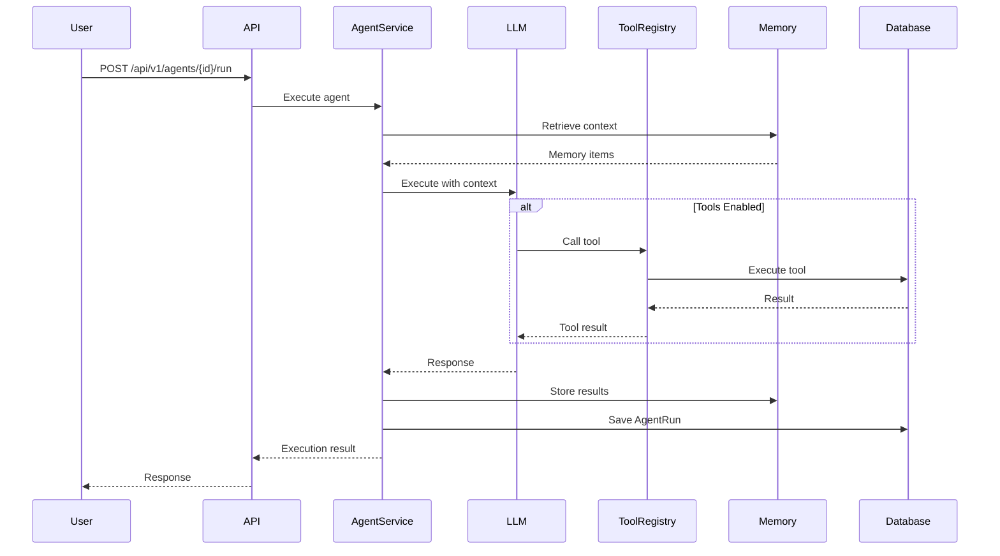
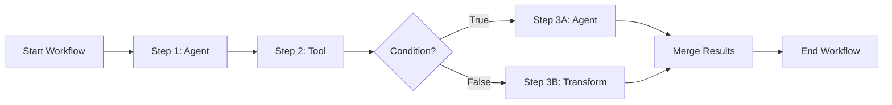
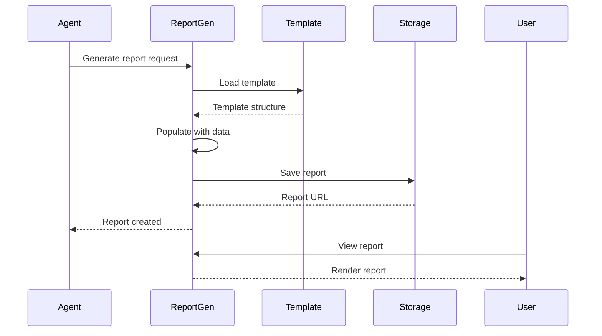

# Core Features

**Version:** 1.0  
**Last Updated:** January 2026  
**Status:** Production Ready

---

## Table of Contents

1. [Agent System](#agent-system)
2. [Workflow Orchestration](#workflow-orchestration)
3. [Report Generation](#report-generation)
4. [Dashboard System](#dashboard-system)
5. [Playground](#playground)
6. [Memory System](#memory-system)

---

## Agent System

### Overview

Agents are the fundamental building blocks of the platform. They are AI-powered entities that can execute research tasks, analyze data, generate reports, and perform monitoring activities.

### Agent Types

```typescript
enum AgentType {
  RESEARCH    // Data gathering and research
  ANALYSIS    // Analytical processing
  REPORTING   // Report generation
  MONITORING  // Ongoing monitoring/tracking
  CUSTOM      // User-defined agents
}
```

### Agent Lifecycle

```typescript
enum AgentStatus {
  DRAFT     // Being created/configured
  ACTIVE    // Published and available
  PAUSED    // Temporarily disabled
  ARCHIVED  // Retired/historical
}
```

### Agent Configuration

**Database Model:** `Agent`

```prisma
model Agent {
  id            String     @id @default(cuid())
  orgId         String
  name          String
  description   String?
  type          AgentType
  status        AgentStatus @default(DRAFT)
  configuration Json       // Agent-specific settings
  
  // LLM Configuration
  // - systemPrompt: Custom system prompt
  // - temperature: LLM temperature (0-1)
  // - maxTokens: Maximum tokens
  // - model: LLM model name
  // - provider: 'anthropic' | 'openai' | 'gwi-spark'
  
  // Tool Configuration
  // - enableTools: Boolean
  // - allowedTools: string[]
  
  createdAt     DateTime   @default(now())
  updatedAt     DateTime   @updatedAt
  
  organization  Organization @relation(...)
  creator       User          @relation(...)
  runs          AgentRun[]
}
```

### Agent Execution

**Execution Flow:**



**Execution Modes:**

1. **Simple Execution** - LLM only, no tools
2. **Tool-Enabled Execution** - LLM with function calling

### Tool Calling

Agents can call tools (functions) to interact with data:

**Available Tools:**
- `create_audience` - Create audience definitions
- `create_insight` - Generate insights
- `create_report` - Generate reports
- `analyze_data` - Analyze datasets
- `search_gwi_data` - Search GWI data
- And more...

**Tool Execution:**
```typescript
// lib/llm.ts - executeAgentWithTools()
const toolResult = await toolRegistry.executeTool(
  toolName,
  params,
  toolContext
)
```

### Agent Runs

**Database Model:** `AgentRun`

```prisma
model AgentRun {
  id          String         @id @default(cuid())
  agentId     String
  orgId       String
  input       Json           // Input parameters
  output      Json?          // Output results
  status      AgentRunStatus @default(PENDING)
  tokensUsed  Int            @default(0)
  error       String?
  startedAt   DateTime?
  completedAt DateTime?
  createdAt   DateTime       @default(now())
  
  agent Agent @relation(...)
}
```

**Run Status:**
- `PENDING` - Queued for execution
- `RUNNING` - Currently executing
- `COMPLETED` - Successfully completed
- `FAILED` - Execution failed
- `CANCELLED` - Cancelled by user

---

## Workflow Orchestration

### Overview

Workflows compose multiple agents and tools into coordinated sequences, enabling complex multi-step research processes.

### Workflow Structure

**Database Model:** `Workflow`

```prisma
model Workflow {
  id          String         @id @default(cuid())
  orgId       String
  name        String
  description String?
  agents      String[]       // Agent IDs in execution order
  steps       Json?          // Step-based workflow definition
  status      WorkflowStatus @default(DRAFT)
  schedule    String?        // Cron expression
  configuration Json         @default("{}")
  createdAt   DateTime       @default(now())
  updatedAt   DateTime       @updatedAt
  
  organization Organization @relation(...)
  runs        WorkflowRun[]
}
```

### Step Types

**1. Agent Step**
- Execute an agent with optional tool support
- Pass data between steps via variables

**2. Tool Step**
- Execute a GWI tool directly
- Useful for data operations without LLM

**3. Condition Step**
- Conditional branching based on expressions
- Route to different steps based on conditions

**4. Transform Step**
- Data transformation operations
- Format, filter, or aggregate data

**5. Parallel Step**
- Execute multiple steps concurrently
- Merge results when all complete

### Workflow Execution

**Execution Flow:**



**Step Execution:**

```typescript
// lib/workflow-steps.ts
export async function executeWorkflow(
  steps: WorkflowStep[],
  context: WorkflowExecutionContext,
  startStepId?: string
): Promise<WorkflowExecutionResult> {
  // Build step map
  const stepMap = new Map<string, WorkflowStep>()
  for (const step of steps) {
    stepMap.set(step.id, step)
  }
  
  // Execute steps sequentially
  let currentStepId = startStepId || steps[0]?.id
  
  while (currentStepId) {
    const step = stepMap.get(currentStepId)
    const result = await executeStep(step, context, stepMap)
    
    // Handle retries if needed
    // Move to next step
    currentStepId = result.nextStepId
  }
}
```

### Workflow Runs

**Database Model:** `WorkflowRun`

```prisma
model WorkflowRun {
  id          String           @id @default(cuid())
  workflowId  String
  orgId       String
  input       Json
  output      Json?
  status      WorkflowRunStatus @default(PENDING)
  startedAt   DateTime?
  completedAt DateTime?
  createdAt   DateTime         @default(now())
  
  workflow Workflow @relation(...)
}
```

### Scheduling

Workflows can be scheduled using cron expressions:

```typescript
// Example: Run daily at 9 AM
schedule: "0 9 * * *"

// Example: Run every Monday at 8 AM
schedule: "0 8 * * 1"
```

**Scheduler:** `lib/scheduler.ts`

---

## Report Generation

### Overview

Reports are customer-facing deliverables generated from agent runs and workflow executions. They support multiple formats and can be customized with templates.

### Report Types

```typescript
enum ReportType {
  PRESENTATION  // PowerPoint-style presentation
  DASHBOARD     // Interactive dashboard
  PDF           // PDF document
  EXPORT        // Data export (CSV, JSON, etc.)
  INFOGRAPHIC   // Visual infographic
}
```

### Report Model

**Database Model:** `Report`

```prisma
model Report {
  id          String       @id @default(cuid())
  orgId       String
  name        String
  type        ReportType
  status      ReportStatus @default(DRAFT)
  content     Json         // Report content/structure
  templateId  String?      // Template used
  publishedAt DateTime?
  viewCount   Int          @default(0)
  createdAt   DateTime     @default(now())
  updatedAt   DateTime     @updatedAt
  
  organization Organization @relation(...)
  template     Template?    @relation(...)
}
```

### Report Generation Flow



### Templates

**Database Model:** `Template`

```prisma
model Template {
  id          String           @id @default(cuid())
  orgId       String
  name        String
  category    TemplateCategory
  content     Json             // Template structure
  isPublic    Boolean          @default(false)
  createdAt   DateTime         @default(now())
  updatedAt   DateTime         @updatedAt
  
  organization Organization @relation(...)
  reports      Report[]
}
```

**Template Categories:**
- `AUDIENCE_ANALYSIS`
- `BRAND_TRACKING`
- `MARKET_RESEARCH`
- `CUSTOM`

---

## Dashboard System

### Overview

Dashboards provide real-time visualization of platform data with customizable widgets and layouts.

### Dashboard Model

**Database Model:** `Dashboard`

```prisma
model Dashboard {
  id          String          @id @default(cuid())
  orgId       String
  name        String
  description String?
  status      DashboardStatus @default(DRAFT)
  layout      Json            // Widget layout configuration
  isPublic    Boolean         @default(false)
  viewCount   Int             @default(0)
  createdAt   DateTime        @default(now())
  updatedAt   DateTime         @updatedAt
  
  organization Organization @relation(...)
}
```

### Widget Types

1. **Metric Widget** - Single metric display
2. **Chart Widget** - Data visualization
3. **Table Widget** - Tabular data
4. **Text Widget** - Rich text content
5. **Agent Status Widget** - Agent execution status
6. **Workflow Status Widget** - Workflow execution status

### Layout System

**Grid-Based Layout:**
- Responsive grid system
- Drag-and-drop widget placement
- Resizable widgets
- Multiple breakpoints (mobile, tablet, desktop)

---

## Playground

### Overview

The Playground is an interactive AI chat interface where users can experiment with agents, test prompts, and explore platform capabilities.

### View Modes

1. **Chat Mode** - Traditional chat interface
2. **Canvas Mode** - Visual block-based interface
3. **Split Mode** - Chat + Canvas side-by-side

### Features

- **Streaming Responses** - Real-time response streaming
- **File Attachments** - Upload files for context
- **Command Palette** - Quick actions (⌘K)
- **Memory Integration** - Access to persistent memory
- **Citations** - Source citations in responses
- **Reasoning Mode** - Show agent reasoning process

### Output Block Types

1. **Text Block** - Formatted text response
2. **Code Block** - Syntax-highlighted code
3. **Chart Block** - Interactive charts
4. **Table Block** - Data tables
5. **Image Block** - Generated or uploaded images
6. **File Block** - File attachments
7. **Agent Block** - Agent execution results
8. **Workflow Block** - Workflow execution results

---

## Memory System

### Overview

The Memory System provides persistent context storage for agents, enabling them to remember information across sessions and workflows.

### Memory Types

```typescript
enum MemoryType {
  SHORT_TERM  // Session-scoped memory
  LONG_TERM   // Persistent memory
  TOOL_MEMORY // Tool-specific memory
}
```

### Memory Model

**Database Model:** `Memory`

```prisma
model Memory {
  id          String     @id @default(cuid())
  orgId       String
  agentId     String?    // Agent-specific or global
  key         String     // Memory key
  value       Json       // Memory value
  type        MemoryType @default(LONG_TERM)
  expiresAt   DateTime?  // Optional expiration
  createdAt   DateTime   @default(now())
  updatedAt   DateTime   @updatedAt
  
  organization Organization @relation(...)
  agent        Agent?       @relation(...)
}
```

### Memory Usage

**Retrieval:**
```typescript
// Get relevant memory for agent
const memoryItems = await prisma.memory.findMany({
  where: {
    orgId,
    OR: [
      { agentId: agentId },  // Agent-specific
      { agentId: null },      // Global context
    ],
    expiresAt: { gt: new Date() },
  },
  orderBy: { createdAt: 'desc' },
  take: 10,
})
```

**Storage:**
```typescript
// Store memory after agent execution
await prisma.memory.create({
  data: {
    orgId,
    agentId,
    key: 'user_preference',
    value: { theme: 'dark' },
    type: 'LONG_TERM',
  },
})
```

### Tool Memory

**Database Model:** `ToolMemory`

```prisma
model ToolMemory {
  id          String   @id @default(cuid())
  orgId       String
  toolName    String
  sessionId   String   // Workflow run or session ID
  params      Json     // Tool parameters
  output      Json     // Tool output
  createdAt   DateTime @default(now())
  
  @@index([orgId, toolName, sessionId])
}
```

**Purpose:** Cache tool results to avoid redundant executions within the same session.

---

## Related Documentation

- [Application Architecture](../architecture/APPLICATION_ARCHITECTURE.md) - Application structure
- [Database Architecture](../architecture/DATABASE_ARCHITECTURE.md) - Database schema
- [API Overview](../api/API_OVERVIEW.md) - API endpoints
- [Data Models - Core](../data-models/CORE_MODELS.md) - Detailed model docs

---

**Last Updated:** January 2026  
**Maintained By:** Engineering Team
